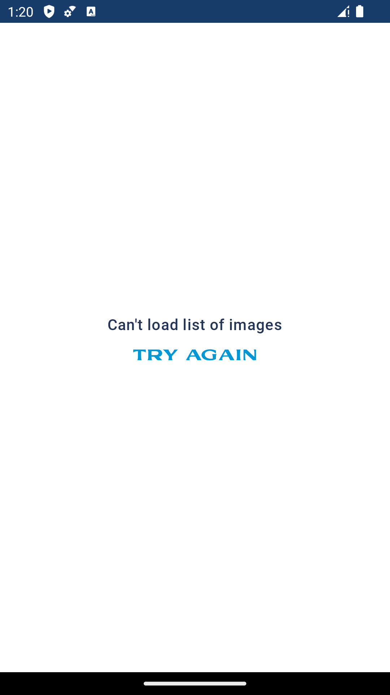
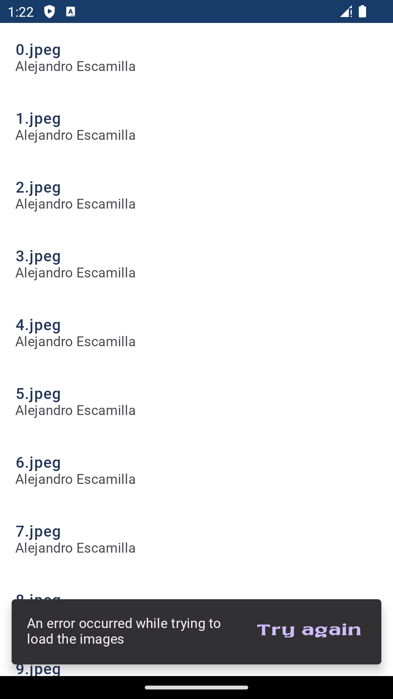
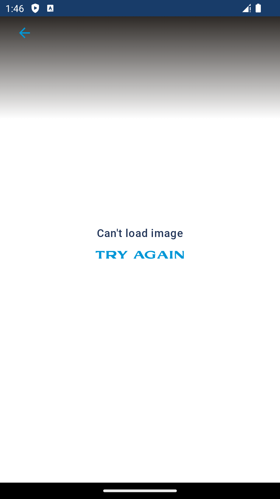
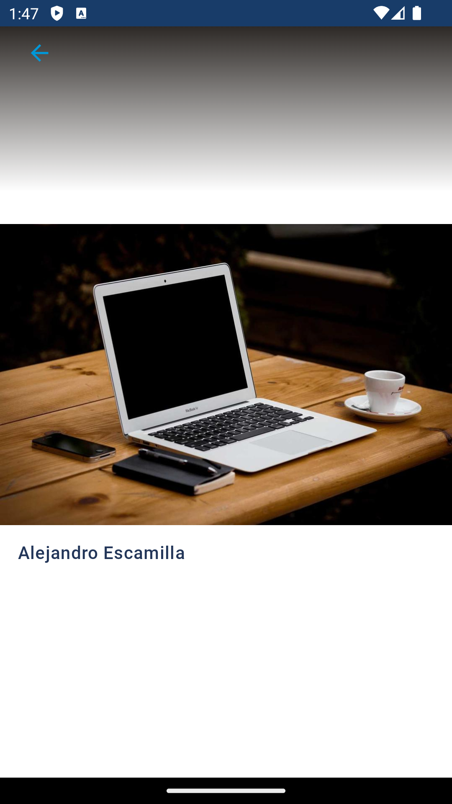
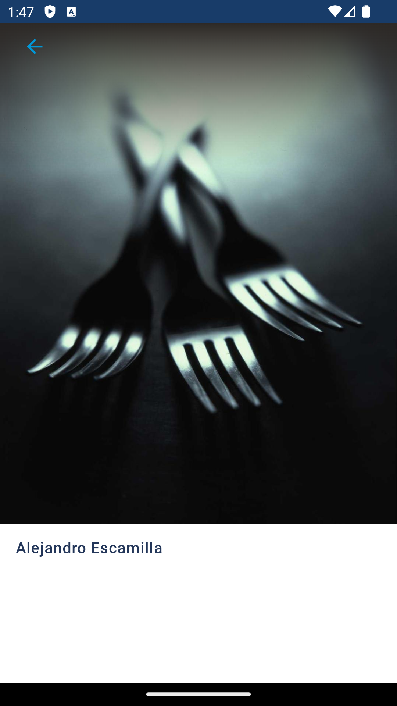

# Picsum Android application

Picsum is an Android application that lists images from the
[Picsum](https://picsum.photos/) REST API and displays each image with a
different layout depending on the image dimensions.

## Features

The application consists of two screens: one displaying the list of images and
another showing the details of a selected image.

### Screen orientation

> The most common orientation for an Android app is portrait, since that's how
most phones are held. While portrait is good for phones, it's terrible for
laptops and tablets, where landscape is preferred. To get the best results for
your app, consider supporting both orientations.
[Android Window Management - Screen Orientation](https://developer.android.com/topic/arc/window-management#screen_orientation)

For this reason, even if the constraints state that only phone portrait needs
to be supported, both landscape and portrait orientation are supported. However,
layout is optimized only for portrait, and landscape mode is only _Supported_.

### Image list

The list is loaded and then displayed to the user following this loading
mechanism:

#### Error screen

* When the user clicks the `Try again` button, the loading mechanism described
above is launched again.

#### Image List screen

The Snackbar visible on this screen appears only when an error occurs while
loading the results from the API.

* When the user clicks the `Try again` button, the loading mechanism described
above is launched again.
* When the user clicks on an image in the list, they are redirected to the
detail screen.

### Image Details

The displayed image is loaded and then shown to the user following this loading
mechanism:

#### Error Screen

* When the user clicks the `Try again` button, the loading mechanism described
above is launched again.

#### Detail Screen

| Landscape | Portrait |
| --------- | -------- |
|  |  |

The image is displayed at the top of the screen if:

* The image's height is greater than its width

**OR**

* There is not enough height on the screen to display the image and the author's
name below it (this can happen, for example, in portrait mode if the screen is
1000px (width) * 1001px (height) and the image is 1000px (width) by 999px
(height)). Adding the height of the status bar and the author label, there is
not enough height on the screen to display all of them.

Otherwise, the image will be displayed centered vertically in the screen.

#### Common to All Screens

* By clicking the back button, the user will be redirected to the previous
list screen.
* Clicking anywhere on the screen will hide (if visible) or show (if hidden) the
back button.